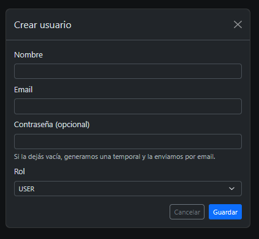
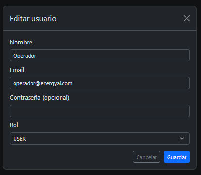
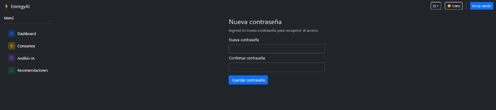

<div align="center">

# ⚡ EnergIA — G9 LATAM Team 48

Repositorio del **Team 48** del Hackathon ONE G9 — LATAM.

Plataforma para el análisis y la optimización del consumo energético (**EnergIA**).

<div align="center">

</div>

</div>

---

## Estructura del repositorio

| Carpeta | Descripción |
|---------|-------------|
| [`frontend/`](./frontend) | Aplicación web (React + Vite) |
| [`backend/`](./backend) | API Spring Boot (JWT, Google, email, Análisis IA, admin, contacto) |
| [`ml-service/`](./ml-service) | Modelo ML (RandomForest + FastAPI) para Análisis IA |
| [`datascience/`](./datascience) | Notebooks, dataset y docs de ciencia de datos (no se despliega) |
| [`docs/`](./docs) | Documentación (arquitectura, auth, recomendaciones, deploy) |
| [`qa/`](./qa) | Checklist P0/P1, smoke scripts y notas NAS (sin tocar código de producto) |

> **Rama de deploy:** `Jorge-martinez` (Vercel + Railway).  
> La rama **`backend`** quedó **sincronizada** con `Jorge-martinez` (mismo contenido operativo; conflictos de prediction/mock resueltos a favor del flujo con `HeuristicPrediction` + `AnalisisPayload`).  
> La rama **`develop`** está vacía a propósito (solo esqueleto de carpetas).  
> No uses `main` para el front: ahí `frontend/` puede estar vacío.

---

## Vista previa del frontend

> Tema claro/oscuro, mapa de idiomas, accesibilidad (lector de pantalla) y UI multilenguaje.
> Detalle completo en el [README del frontend](./frontend/README.md).

<div align="center">

### Dashboard — EnergIA


</div>

<table>
  <tr>
    <td width="50%"><strong>Consumos</strong><br /></td>
    <td width="50%"><strong>Análisis IA</strong><br /></td>
  </tr>
  <tr>
    <td width="50%"><strong>Historia de consumos</strong><br /></td>
    <td width="50%"><strong>Mapa de idiomas</strong><br /></td>
  </tr>
  <tr>
    <td width="50%"><strong>Recomendaciones</strong><br /></td>
    <td width="50%"><strong>Contáctanos</strong> — formulario + Equipo 48<br /></td>
  </tr>
  <tr>
    <td width="50%"><strong>Panel Admin — Usuarios</strong><br /></td>
    <td width="50%"><strong>Admin — Análisis IA</strong><br /></td>
  </tr>
  <tr>
    <td width="50%"><strong>Login</strong><br /></td>
    <td width="50%"><strong>Registro</strong><br /></td>
  </tr>
  <tr>
    <td width="50%"><strong>Crear usuario</strong><br /></td>
    <td width="50%"><strong>Editar usuario</strong><br /></td>
  </tr>
  <tr>
    <td width="50%"><strong>Recuperar contraseña</strong><br /></td>
    <td width="50%"><strong>Nueva contraseña</strong> (vía link del mail)<br /></td>
  </tr>
  <tr>
    <td width="50%"><strong>Verificar email</strong> (vía link del mail)<br /></td>
    <td width="50%"></td>
  </tr>
</table>

> **Nueva contraseña** y **Verificar email** se abren solo con el link del correo (`?resetToken=` / `?verifyToken=`). En **prod** los mails salen por **Resend**; en **local** podés usar SMTP (Gmail). Detalle de flujos y troubleshooting: [`qa/QA.md`](./qa/QA.md). Scripts de smoke y checklist: [`qa/README.md`](./qa/README.md).

Documentación de auth, email y admin: [`docs/backend/AUTH_EMAIL_ADMIN.md`](./docs/backend/AUTH_EMAIL_ADMIN.md).

---

## Deploy (demo en línea)

| Capa | Plataforma | URL / notas |
|------|------------|-------------|
| **Frontend** | [Vercel](https://vercel.com) | App pública (Root Directory `frontend`, rama `Jorge-martinez`) |
| **Backend** | [Railway](https://railway.app) | https://g9-latam-team-48-production.up.railway.app |
| **Base de datos** | Railway MySQL | Flyway crea tablas y usuarios demo al arrancar |

Variables del front en Vercel (Production / Preview):

```env
VITE_API_URL=https://g9-latam-team-48-production.up.railway.app
VITE_USE_MOCK_AUTH=false
VITE_USE_MOCK_API=false
VITE_GOOGLE_CLIENT_ID=tu-client-id.apps.googleusercontent.com
```

En Railway (backend): `GOOGLE_CLIENT_ID` con el **mismo** Client ID. En Google Cloud Console → OAuth Web: origins `https://tu-app.vercel.app` y `http://localhost:5173`.
Usuarios demo (emails en Flyway **V6**; contraseñas solo por canal del equipo / variables QA, **no en Git**):

| Email | Rol |
|-------|-----|
| `operador@energyai.com` | USER |
| `admin@energyai.com` | ADMIN |
| `team48@energyai.com` | USER |

> Un push a `Jorge-martinez` redespliega Vercel y Railway si el auto-deploy está activo en esa rama.

---

## Highlights recientes

- **Google Sign-In**
- **Auth por email** (registro/verify/login, forgot/reset, admin CRUD)
- **Análisis IA** with `AnalisisPayload`, historial, V7 anonymous, result email
- **`HeuristicPrediction` fallback**
- **Recomendaciones** tip keys + i18n
- **Contáctanos** + Equipo 48; **Admin**
- **Mapa idiomas** / i18n / a11y
- **QA cerrado** in [`qa/`](./qa)
- Rama **`backend`** alineada with `Jorge-martinez`

---

## Equipo 48

| Integrante | Rol |
|------------|-----|
| Jorge Gustavo Martinez | Full Stack Developer |
| Ricardo Chirinos | Data Analyst |
| Elizabeth Díaz Familia | Data Scientist |
| Carlos Miyen Brandolino | Backend Developer |
| Germán French | Backend Developer |
| Jharle Compres | Data Analyst |
| Neil Jacome | Project Manager |

Perfiles y fotos: pantalla **Contáctanos** del frontend. Detalle y links: [frontend/README.md § Equipo](./frontend/README.md#equipo).

---

## Cómo ejecutar

```bash
# Frontend
cd frontend && npm install && npm run dev

# Backend (otra terminal)
cd backend && mvn spring-boot:run

# ML opcional
cd ml-service && uvicorn app.main:app --reload --port 8000
```

Front en `http://localhost:5173`. Más detalle: [frontend/README.md](./frontend/README.md) · [backend/README.md](./backend/README.md) · [datascience/README.md](./datascience/README.md) · [qa/README.md](./qa/README.md).

---

<div align="center">

Hackathon ONE G9 — LATAM · Team 48 · EnergIA · `energyaiteam48@gmail.com`

</div>
