<div align="center">

# ⚡ EnergIA — Frontend

<div align="center">

</div>

**Aplicación web para analizar y optimizar el consumo energético**

Dashboard, autenticación (email y Google), análisis asistido por IA, recomendaciones, panel administrativo e interfaz multilenguaje.

<br />


<br />

Hackathon ONE G9 · Team 48

</div>

---

## Tabla de contenidos

- [Demo en producción](#demo-en-producción)
- [Características](#características)
- [Stack tecnológico](#stack-tecnológico)
- [Requisitos e instalación](#requisitos-e-instalación)
- [Configuración](#configuración)
- [Scripts](#scripts)
- [Autenticación y sesión](#autenticación-y-sesión)
- [Internacionalización](#internacionalización)
- [Accesibilidad](#accesibilidad)
- [Integración con la API](#integración-con-la-api)
- [Análisis IA (frontend)](#análisis-ia-frontend)
- [Experiencia de usuario](#experiencia-de-usuario)
- [Capturas de pantalla](#capturas-de-pantalla)
- [Estructura del proyecto](#estructura-del-proyecto)
- [Documentación relacionada](#documentación-relacionada)
- [Calidad y pruebas](#calidad-y-pruebas)
- [Equipo](#equipo)

---

## Demo en producción

| Componente | URL / ubicación |
|------------|-----------------|
| **Frontend** | [g9-latam-team-48.vercel.app](https://g9-latam-team-48.vercel.app) |
| **API (Railway)** | `https://g9-latam-team-48-production-f9a0.up.railway.app` |
| **ML (Render)** | `https://ml-service-lbfk.onrender.com` (solo backend; ver [`docs/DEPLOY_PRODUCCION.md`](../docs/DEPLOY_PRODUCCION.md)) |
| **Deploy Git** | Rama **`Jorge-martinez`** · Vercel **Root Directory:** `frontend` |

La URL de Railway es **solo API**; abrir `/` en el navegador puede responder 403. Usá siempre la app en Vercel.

Tras cambiar variables `VITE_*` en Vercel, ejecutá **Redeploy** (Vite embebe env en build).

---

## Características

| Módulo | Descripción |
|--------|-------------|
| **Dashboard** | KPIs de consumo y costo, resumen en lenguaje claro, gráfico mensual, comparativas mock (real vs predicción, pico vs valle) y recomendaciones destacadas. |
| **Consumos** | Totales, historial con indicador normal / sobre promedio y evolución gráfica. |
| **Historia de consumos** | Análisis guardados del usuario; gráficos con todo el historial, tabla paginada, detalle con datos ingresados y tabla de sugerencias; reenvío de mail. |
| **Análisis IA** | Formulario ML de **12 campos** por tipo de inmueble; panel derecho con gráfico consumo vs referencia y tips priorizados tras analizar. |
| **Recomendaciones** | Catálogo de tips traducidos (hábitos e inmueble). |
| **Registro / login** | Modal unificado: email + contraseña, recuperación, **Google Sign-In** (GIS) y aviso visible si bloqueadores interfieren con Google. |
| **Verificar email / reset** | Rutas dedicadas activadas solo por link del correo (`verifyToken`, `resetToken`). |
| **Panel admin** | CRUD de usuarios y vista global de análisis IA (rol `ADMIN`). |
| **Contáctanos** | Formulario de contacto y equipo en flip cards. |
| **Mapa de idiomas** | Selector visual con confirmación (desktop y móvil). |
| **Tema claro / oscuro** | Toggle en header; persistido en `localStorage`. |
| **Navegación pública** | La app es usable sin sesión; historial y admin requieren login. |

---

## Stack tecnológico

| Tecnología | Rol |
|------------|-----|
| [React 19](https://react.dev/) | UI declarativa y enrutado por estado (`pagina`) |
| [Vite 7](https://vitejs.dev/) | Dev server y build de producción |
| [Bootstrap 5](https://getbootstrap.com/) + [React Bootstrap](https://react-bootstrap.netlify.app/) | Layout, modales, utilidades |
| [Recharts](https://recharts.org/) | Gráficos del dashboard y consumos |
| [Axios](https://axios-http.com/) | Cliente HTTP hacia Spring / ML |
| [React Icons](https://react-icons.github.io/react-icons/) | Iconografía del menú |
| [Playwright](https://playwright.dev/) (dev) | Capturas automatizadas para este README |

Estado global: **Context API** (`AuthContext`, `LocaleContext`, `ThemeContext`, `NavigationContext`). Anuncios para lectores de pantalla: **`SrAnnouncer`**.

---

## Requisitos e instalación

- **Node.js 18+**
- **npm**

```bash
cd frontend
npm install
cp .env.example .env   # ajustar URLs y Client ID
npm run dev
```

Aplicación en **http://localhost:5173**.

Para API local: backend en `:8080` o apuntar `VITE_API_URL` a Railway (ver [Configuración](#configuración) y [`qa/README.md`](../qa/README.md)).

---

## Configuración

Copiá [`.env.example`](./.env.example) → `.env`.

| Variable | Descripción |
|----------|-------------|
| `VITE_API_URL` | Base URL del backend. En prod: `https://g9-latam-team-48-production.up.railway.app`. Vacío = misma origen (Docker/nginx). |
| `VITE_ML_API_URL` | FastAPI ML opcional (`:8000`). Análisis IA usa el backend → ML. |
| `VITE_GOOGLE_CLIENT_ID` | Client ID OAuth **Web** (mismo valor que `GOOGLE_CLIENT_ID` en Railway). Sin esto, no se muestra el botón Google. |

**Google Cloud Console** (OAuth Web): registrar **Authorized JavaScript origins** para cada URL de prueba, por ejemplo:

- `http://localhost:5173`
- `https://g9-latam-team-48.vercel.app`
- Cada **preview** de Vercel que uses (origen exacto de la barra de direcciones)

En Vercel (prod), ejemplo mínimo:

```env
VITE_API_URL=https://g9-latam-team-48-production.up.railway.app
VITE_GOOGLE_CLIENT_ID=<tu-client-id>.apps.googleusercontent.com
```

Las contraseñas demo **no** van en el repo; ver [`qa/README.md`](../qa/README.md).

---

## Scripts

| Comando | Descripción |
|---------|-------------|
| `npm run dev` | Servidor de desarrollo Vite |
| `npm run build` | Build estático en `dist/` |
| `npm run preview` | Sirve el build localmente |
| `npm run screenshots` | Genera PNG en `screenshots/` (requiere `npm run dev` y, para Google en capturas, `VITE_GOOGLE_CLIENT_ID`) |
| `npm run screenshots:auth` | Solo login y registro (recomendado contra Vercel + `APP_URL`) |
| `npm run screenshots:analisis` | Solo Análisis IA (formulario 12 campos) |
| `npm run bake:world-map` | Regenera assets del mapa de idiomas |

---

## Autenticación y sesión

### Email y contraseña

1. **Registro** → el backend envía mail de verificación (SMTP).
2. **Verificar** → ruta `/verify-email?verifyToken=…`.
3. **Login** → JWT solo si el email está verificado.

Recuperación: **olvidé contraseña** envía link; **reset** solo con `resetToken` del mail.

### Google Sign-In

- Botón **Google Identity Services** en login y registro (requiere `VITE_GOOGLE_CLIENT_ID`).
- El backend valida el ID token en `POST /api/v1/auth/google` y emite JWT (email considerado verificado).

#### Bloqueadores de anuncios y privacidad

Extensiones (uBlock, Privacy Badger, etc.) pueden **bloquear el script de Google** o **impedir que abra la ventana** al hacer clic en “Continuar con Google”.

En el modal se muestra un **cartel amarillo** solo si Google no responde (`alert-warning`, clave `auth.googleBlockHintShort`):

- **Sin cartel:** login normal con botón Google y email.
- **Con cartel:** tras clic en Google sin popup (~3,2 s) o si falla el script GIS — mensaje corto: *«Deshabilitá el bloqueador de anuncios para ingresar con Google…»*

| Momento | UI |
|---------|-----|
| Apertura del modal | Sin aviso (login limpio) |
| Bloqueador / popup bloqueado | Cartel amarillo con texto corto |

Detección en cliente (`LoginModal.jsx` + `googleSignInSupport.js`):

1. **Clic en Google** → temporizador; si no hay blur de ventana (popup) ni credencial en ~2 s, se asume bloqueo.
2. **Error `googleScriptFailed`** al cargar GIS → mismo aviso ampliado.
3. **Login por email y contraseña** sigue disponible siempre.

### Login — dos estados en pantalla

| Login **sin cartel** | **Con cartel** (bloqueador traba Google) |
|:---:|:---:|
| 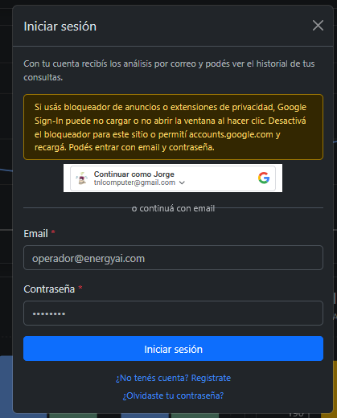 |  |

Archivos: `screenshots/login.png` y `screenshots/login-bloqueador.png`.

**Google Cloud Console** (OAuth Web): registrar **Authorized JavaScript origins** para cada URL de prueba (ver [Configuración](#configuración)).

### Sesión JWT (cliente)

- Token y perfil en **`localStorage`** (`token`, `user`); no hay refresh token en esta demo.
- Expiración según `JWT_EXPIRATION` del backend.
- Si el token vence o `/users/me` responde 401/403: limpieza de sesión, dashboard sin modal de login automático, rutas protegidas no montadas hasta reautenticarse.
- Hidratación: no se muestra UI “logueada” hasta validar token con `/api/v1/users/me`.

### Cuentas demo (seed Flyway V6)

| Rol | Email |
|-----|--------|
| Operador | `operador@energyai.com` |
| Admin | `admin@energyai.com` |
| Equipo 48 | `team48@energyai.com` |

Detalle SMTP, admin y Google en backend: [`docs/backend/AUTH_EMAIL_ADMIN.md`](../docs/backend/AUTH_EMAIL_ADMIN.md).

---

## Internacionalización

- **21 idiomas** con UI completa; packs adicionales en el mapa (traducción parcial con fallback a inglés).
- Detección inicial del idioma del navegador; fallback **español**.
- Persistencia: `localStorage.locale`.
- Atributo **`lang`** en `<html>` sincronizado con el locale activo.
- Diccionarios: `src/i18n/` (`locales/`, `sections/`, `packs/`).

---

## Accesibilidad

La interfaz está pensada para **teclado** y **lectores de pantalla** (NVDA, Narrador, VoiceOver):

- Enlaces **saltar al contenido** y **saltar al menú**.
- Landmarks semánticos (`header`, `nav`, `main`, `aside`).
- **`SrAnnouncer`**: cambios de página, idioma, tema, sesión y apertura del modal de login.
- Formularios con **labels**; errores con roles ARIA donde aplica.
- Gráficos Recharts acompañados de **tabla de datos** para SR (`ChartSrTable`, clase `visually-hidden`).
- Botones solo icono con **`aria-label`** en header y acciones admin.

Guía de pruebas (sin ser usuario no vidente), claves `a11y.*` y mantenimiento: **[`docs/frontend/ACCESIBILIDAD.md`](../docs/frontend/ACCESIBILIDAD.md)**.

---

## Integración con la API

Cliente: `src/services/api.js` (Axios + interceptor 401).

| Método | Ruta | Uso |
|:------:|------|-----|
| `POST` | `/api/v1/auth/register` | Alta + verificación por mail |
| `POST` | `/api/v1/auth/login` | JWT (email verificado) |
| `POST` | `/api/v1/auth/google` | `{ credential }` → JWT |
| `POST` | `/api/v1/auth/verify-email` | Confirmar cuenta |
| `POST` | `/api/v1/auth/resend-verification` | Reenviar mail |
| `POST` | `/api/v1/auth/forgot-password` | Solicitar reset |
| `POST` | `/api/v1/auth/reset-password` | Nueva contraseña |
| `GET` | `/api/v1/users/me` | Perfil (Bearer) |
| `GET/POST/PUT/DELETE` | `/api/v1/admin/users` | Admin usuarios |
| `POST` | `/api/v1/contact` | Formulario contacto |
| `GET` | `/api/consumos` | Series de consumo |
| `GET` | `/api/recomendaciones` | Recomendaciones |
| `POST` | `/api/analisis` | Análisis IA (Spring → ML/heurística); persiste consulta |
| `GET` | `/api/analisis/mis?page&size` | Historial del usuario (paginado) |
| `GET` | `/api/analisis/mis/chart-points` | Puntos ligeros para gráficos del historial |

Cabecera autenticada: `Authorization: Bearer <accessToken>`.

---

## Análisis IA (frontend)

Página **`AnalisisIA.jsx`**: layout en dos columnas (formulario + resultados), validación por campo, hints accesibles y envío a cadena **ML directo** → **Spring** → **heurística local** (`iaService.js`).

### Tipos de instalación

- `APARTAMENTO`
- `CASA_UNIFAMILIAR`
- `PEQUENO_ESTABLECIMIENTO_COMERCIAL`

Cada tipo muestra texto de ayuda contextual bajo el selector.

### Formulario ML (12 campos)

Contrato alineado con backend (`AnalisisPayload`) y `src/utils/analisisMlContract.js`:

| Campo | Uso |
|--------|-----|
| Tipo de instalación | Apartamento, casa o comercio |
| Consumo mensual (kWh) | Obligatorio |
| Consumo mes anterior (kWh) | Obligatorio |
| Superficie (m²) | Obligatorio |
| Cantidad de personas | Obligatorio |
| Cantidad de equipos | Obligatorio |
| Horas de uso de AA por día | Obligatorio |
| Aislamiento térmico | Bueno / Regular / Malo |
| Iluminación LED (%) | Obligatorio |
| Antigüedad de la construcción (años) | Obligatorio |
| Zona | Suburbana, urbana costera, urbana interior |
| Antigüedad de electrodomésticos (años) | Obligatorio |

**Opcional (legacy, no enviados al modelo actual):** horas de alto consumo por día y toggle de consumo en horario pico.

Si hay sesión, se muestra el aviso de envío del resultado por correo al email del usuario.

### Panel de resultados (columna derecha)

- **Tu consumo vs referencia** — gráfico Recharts al completar consumo y ejecutar análisis.
- **Sugerencias** — tabla con prioridad, texto i18n (`analysis.tipsList.*`) y enfoque; claves generadas en backend (`AnalisisTipsComposer` + reglas).
- Tarjetas de **nivel**, **ahorro**, **confianza** y **benchmark** cuando hay respuesta.

### Persistencia y reutilización

- Historial y admin muestran los mismos campos en **`AnalysisRequestFieldsTable`**.
- **Repetir análisis** desde Historia precarga borrador (`analisisDraft.js`).

Documentación de contrato: [`docs/backend/ANALISIS_IA.md`](../docs/backend/ANALISIS_IA.md), [`ml-service/README.md`](../ml-service/README.md).

Dashboard y consumos: datos desde **`GET /api/consumos`**, **`/api/analytics/*`** (MySQL dataset o serie demo del backend).

---

## Experiencia de usuario

- **App shell**: header fijo, sidebar en desktop, offcanvas en móvil.
- **Estados**: `Loader`, `ErrorState` (reintentar), `EmptyState`.
- **Capa de servicios** contra API Spring (`VITE_API_URL`).
- **Responsive**: menú hamburguesa &lt; `md`, grid Bootstrap en tarjetas y gráficos.

---

## Capturas de pantalla

Galería en [`screenshots/`](./screenshots/). Índice: [`screenshots/README.md`](./screenshots/README.md).

<div align="center">

### Dashboard

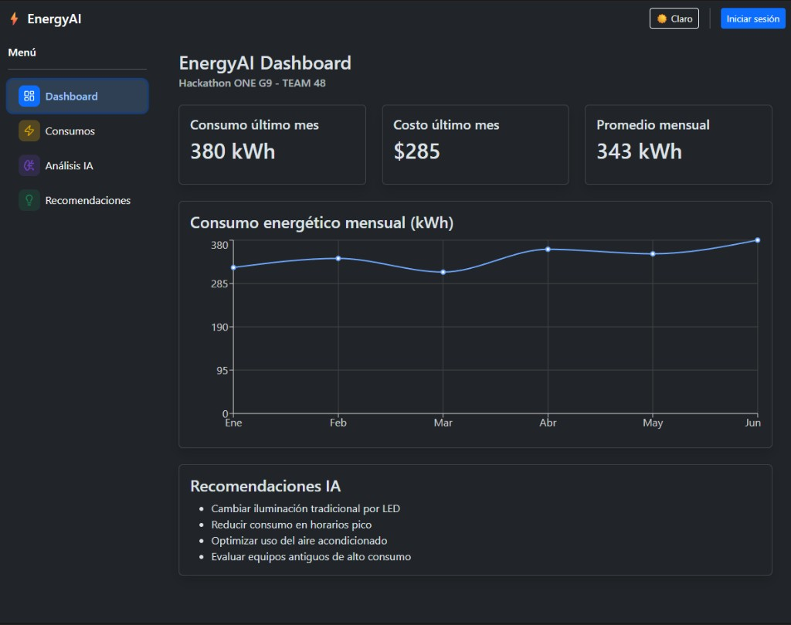

</div>

<div align="center">

### Análisis Inteligente IA (formulario ML)

Formulario de 12 campos por tipo de inmueble, sección opcional legacy y placeholders de gráfico / sugerencias hasta pulsar **Analizar consumo**.

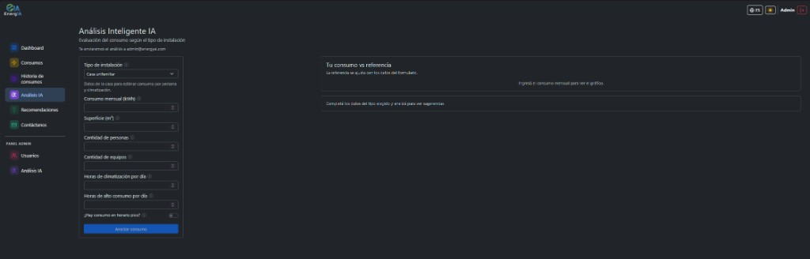

</div>

<div align="center">

### Login — Google y bloqueador de anuncios

| Sin cartel | Cartel amarillo (texto corto) |
|:---:|:---:|
|  |  |

</div>

<table>
  <tr>
    <td width="50%"><strong>Consumos</strong><br />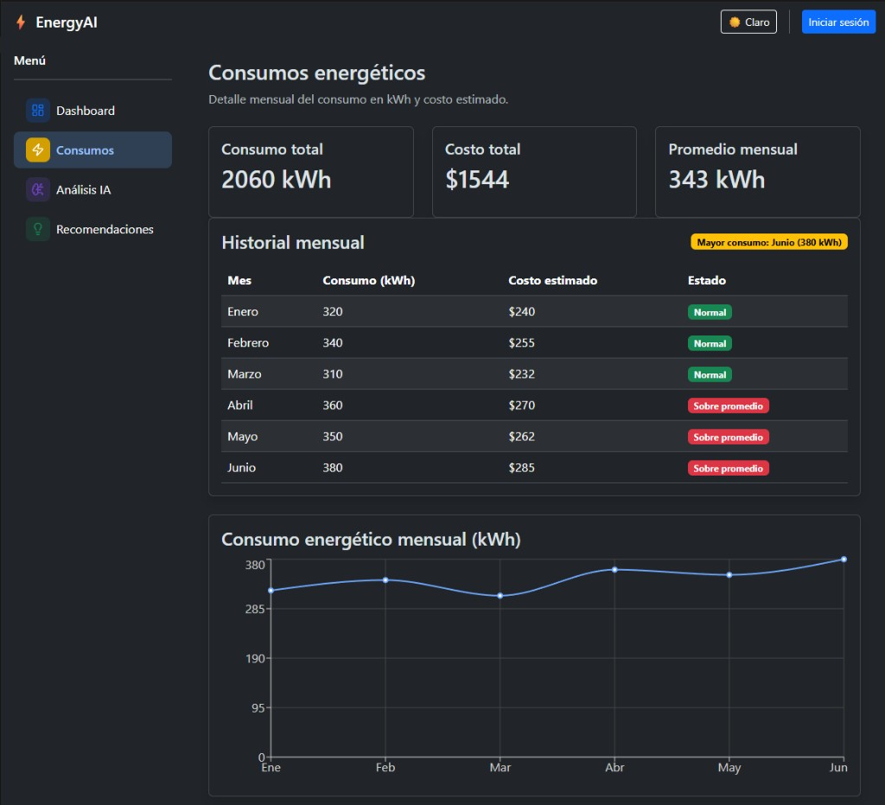</td>
    <td width="50%"><strong>Historia de consumos</strong><br />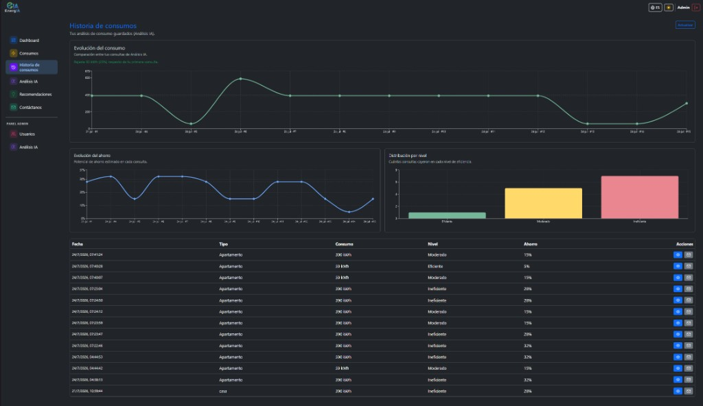</td>
  </tr>
  <tr>
    <td width="50%"><strong>Mapa de idiomas</strong><br />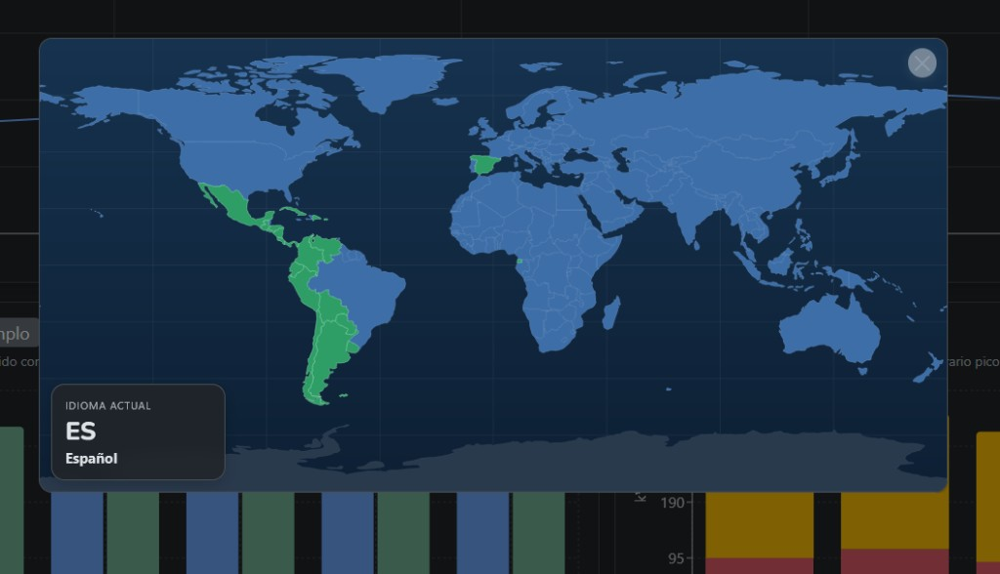</td>
    <td width="50%"><strong>Recomendaciones</strong><br />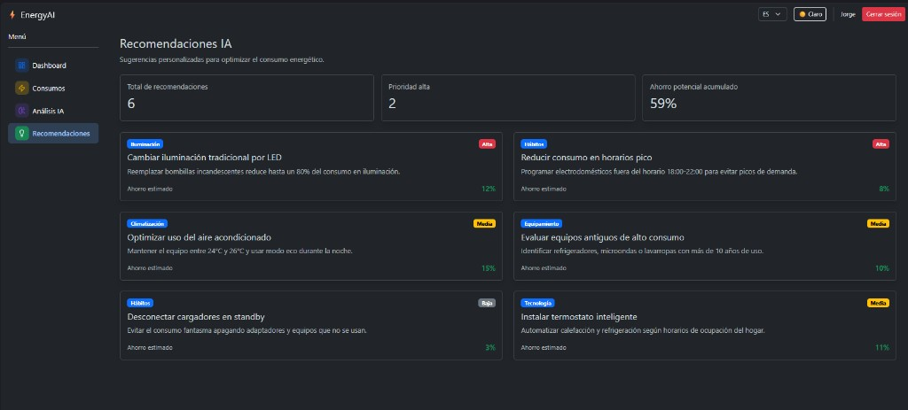</td>
  </tr>
  <tr>
    <td width="50%"><strong>Contáctanos</strong><br />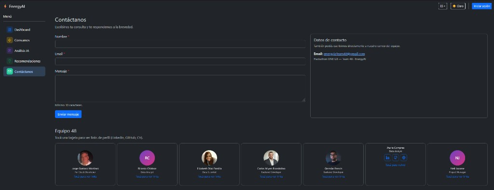</td>
    <td width="50%"><strong>Admin — Usuarios</strong><br />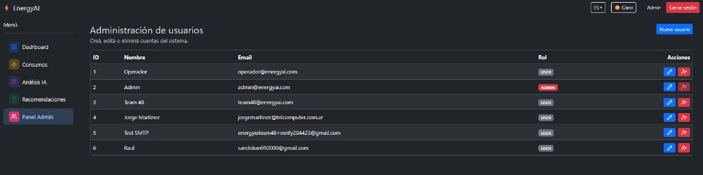</td>
  </tr>
  <tr>
    <td width="50%"><strong>Admin — Análisis</strong><br />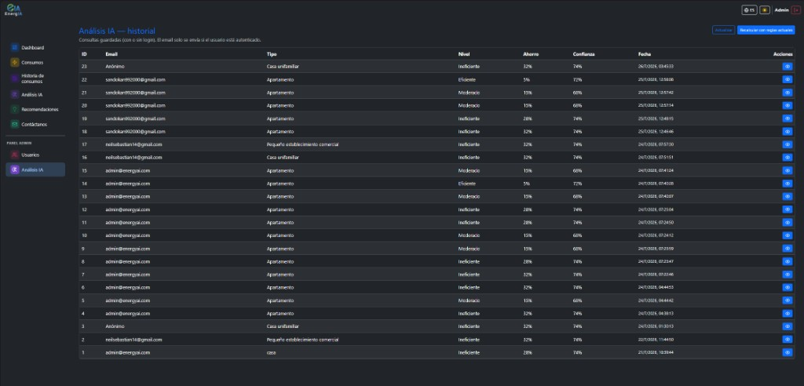</td>
    <td width="50%"><strong>Registro</strong> (email + Google)<br />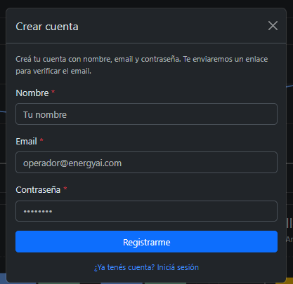</td>
  </tr>
  <tr>
    <td width="50%"><strong>Recuperar contraseña</strong><br />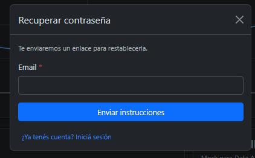</td>
    <td width="50%"></td>
  </tr>
  <tr>
    <td colspan="2"><strong>Verificar email / Reset</strong> (vía link del mail)<br />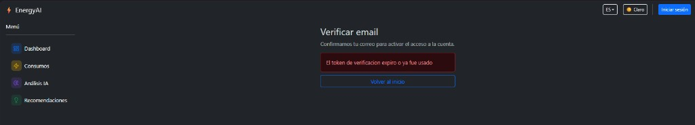</td>
  </tr>
</table>

Regenerar (con dev server activo y `.env` con Google si querés el botón en las capturas):

```bash
npm run screenshots
```

Las pantallas **verify** y **reset** dependen del link del correo; en demo el SMTP puede no entregar a todas las bandejas.

---

## Estructura del proyecto

```
frontend/
├── public/                 # Estáticos (logos, fotos equipo)
├── screenshots/            # PNG del README
├── scripts/                # Playwright, mapa idiomas
├── src/
│   ├── components/         # UI reutilizable (charts, modals, SrAnnouncer…)
│   ├── context/            # Auth, Locale, Theme, Navigation
│   ├── data/               # Roster equipo y assets estáticos
│   ├── hooks/              # useFetch, etc.
│   ├── i18n/               # Traducciones
│   ├── layouts/            # MainLayout (shell + skip links)
│   ├── pages/              # Vistas por ruta lógica
│   ├── services/           # API, auth, consumos, análisis
│   └── utils/              # Sesión, validación, Google GIS helpers
├── .env.example
├── index.html
├── package.json
└── vite.config.js
```

---

## Documentación relacionada

| Documento | Contenido |
|-----------|-----------|
| [`docs/frontend/ACCESIBILIDAD.md`](../docs/frontend/ACCESIBILIDAD.md) | Accesibilidad y pruebas SR |
| [`docs/backend/AUTH_EMAIL_ADMIN.md`](../docs/backend/AUTH_EMAIL_ADMIN.md) | Auth, mail, admin |
| [`docs/backend/ANALISIS_IA.md`](../docs/backend/ANALISIS_IA.md) | Contrato análisis |
| [`backend/README.md`](../backend/README.md) | API Spring |
| [`qa/README.md`](../qa/README.md) | Smoke P0/P1, secretos locales |
| [`README.md`](../README.md) | Visión general del monorepo |

---

## Calidad y pruebas

- Checklist y scripts: carpeta [`qa/`](../qa/) (`run-p0.ps1`, `run-p1.ps1`, inspección Google/i18n).
- Build de producción: `npm run build` antes de merge a rama de deploy.
- Google Sign-In en prod: validar origen OAuth + variables Vercel/Railway alineadas.

---

## Equipo

Desarrollado en el **Hackathon ONE G9 — Team 48**.

Roster en la página **Contáctanos** (`src/data/equipo.js`, fotos en `public/equipo/`).

| Integrante | Rol |
|------------|-----|
| Jorge Gustavo Martinez | Full Stack |
| Ricardo Chirinos | Data Analyst |
| Elizabeth Díaz Familia | Data Scientist |
| Carlos Miyen Brandolino | Backend |
| Germán French | Backend |
| Jharle Compres | Data Analyst |
| Neil Jacome | Project Manager |

Contacto: **energyaiteam48@gmail.com**

<div align="center">

⚡ *EnergIA — energía más inteligente*

</div>
